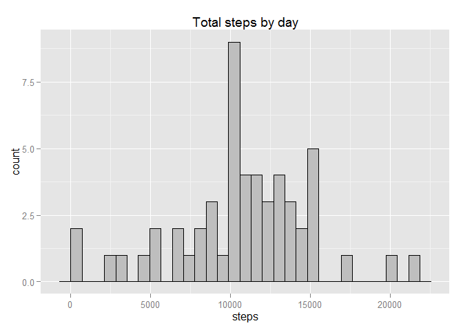
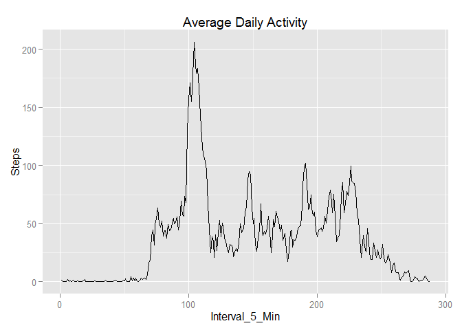
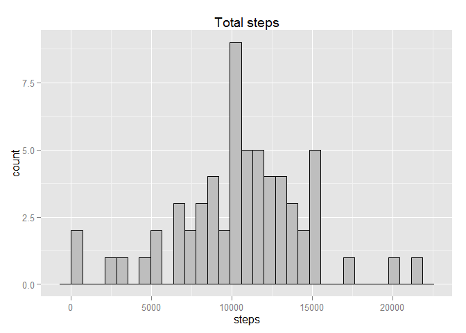
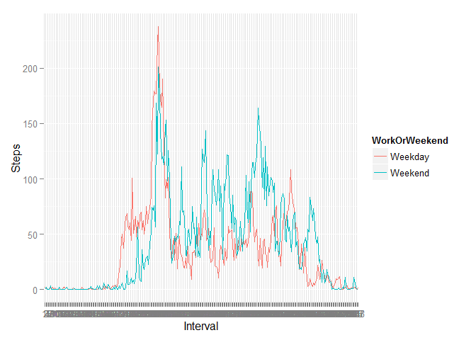
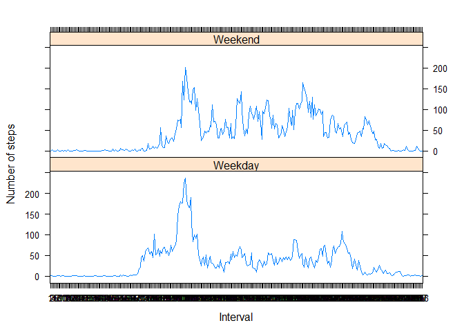

# Reproducible Research: Peer Assignment One

## Activity monitoring data analysis

Questions refering to assignments are numbered from the 1-5. More on the task can be foung from here: <https://github.com/rdpeng/RepData_PeerAssessment1>  

### 1. Loading and preprocessing the data

Load required R packages: 


```r
library(ggplot2)

library(plyr)

library(downloader)

library(mice)
```

```
## Loading required package: Rcpp
## Loading required package: lattice
## mice 2.22 2014-06-10
```


#### 1.1 Load the data (i.e. read.csv())

Downloading data from the webpage and unzipping it: 


```r
fileUrl <- "https://d396qusza40orc.cloudfront.net/repdata%2Fdata%2Factivity.zip"

if (!file.exists("data activity")) { }
```

```
## NULL
```

```r
download(fileUrl, dest="data activity.zip", mode="wb") 

unzip ("data activity.zip")

activitydata <- read.csv("activity.csv", colClasses =c("numeric", "character","numeric"))
```


#### 1.2 Process/transform the data (if necessary) into a format suitable for your analysis


Reading data and converting variable date to Date class and variable interval  to Factor class:


```r
activitydata$date <- as.Date(activitydata$date)

activitydata$interval <- as.factor(activitydata$interval)

head(activitydata)
```

```
##   steps       date interval
## 1    NA 2012-10-01        0
## 2    NA 2012-10-01        5
## 3    NA 2012-10-01       10
## 4    NA 2012-10-01       15
## 5    NA 2012-10-01       20
## 6    NA 2012-10-01       25
```

```r
str(activitydata)
```

```
## 'data.frame':	17568 obs. of  3 variables:
##  $ steps   : num  NA NA NA NA NA NA NA NA NA NA ...
##  $ date    : Date, format: "2012-10-01" "2012-10-01" ...
##  $ interval: Factor w/ 288 levels "0","5","10","15",..: 1 2 3 4 5 6 7 8 9 10 ...
```


### 2. What is mean total number of steps taken per day?


#### 2.1 Calculate the total number of steps taken per day

This is done simply by using aggregate function. We ignore missing values:


```r
Totalsteps <- aggregate(steps ~ date, data = activitydata, sum, na.rm = TRUE)
head(Totalsteps)
```

```
##         date steps
## 1 2012-10-02   126
## 2 2012-10-03 11352
## 3 2012-10-04 12116
## 4 2012-10-05 13294
## 5 2012-10-06 15420
## 6 2012-10-07 11015
```


#### 2.2 Make a histogram of the total number of steps taken each day

I used qplot function from the gglot2 package to draw the histogram. 

```r
qplot(steps, main = "Total steps by day",data = Totalsteps) + geom_histogram(colour="black", fill="grey")
```

```
## stat_bin: binwidth defaulted to range/30. Use 'binwidth = x' to adjust this.
## stat_bin: binwidth defaulted to range/30. Use 'binwidth = x' to adjust this.
```

 


#### 2.3 Calculate and report the mean and median of the total number of steps taken per day.

```r
mean(Totalsteps$steps)
```

```
## [1] 10766.19
```

```r
median(Totalsteps$steps)
```

```
## [1] 10765
```


### 3. What is the average daily activity pattern?

#### 3.1 Make a time series plot of the 5-minute interval and the average number of steps taken, averaged across all days


```r
average_5min_interval <- ddply(activitydata, .(interval), summarise, mean=mean(steps, na.rm = TRUE))
average_5min_interval$interval <-as.integer(average_5min_interval$interval)
colnames(average_5min_interval) <- c("Interval_5_Min", "Steps")


qplot(Interval_5_Min, Steps, data=average_5min_interval, main = "Average Daily Activity", geom="line")  
```

 


#### 3.2 Which 5-minute interval, on average across all the days in the dataset, contains the maximum number of steps?

It seems that most steps are taken in the mornings.


```r
average_5min_interval[which.max(average_5min_interval$Steps), ]
```

```
##     Interval_5_Min    Steps
## 104            104 206.1698
```

### 4.Imputing missing values

#### 4.1 Calculate and report the total number of missing values in the dataset (i.e. the total number of rows with NA s)
About 13 % of observatation has no value for step variable. 

```r
sum(is.na(activitydata))
```

```
## [1] 2304
```

```r
round(sum(is.na(activitydata))/nrow(activitydata), 3)
```

```
## [1] 0.131
```

```r
summary(activitydata)
```

```
##      steps             date               interval    
##  Min.   :  0.00   Min.   :2012-10-01   0      :   61  
##  1st Qu.:  0.00   1st Qu.:2012-10-16   5      :   61  
##  Median :  0.00   Median :2012-10-31   10     :   61  
##  Mean   : 37.38   Mean   :2012-10-31   15     :   61  
##  3rd Qu.: 12.00   3rd Qu.:2012-11-15   20     :   61  
##  Max.   :806.00   Max.   :2012-11-30   25     :   61  
##  NA's   :2304                          (Other):17202
```


#### 4.2 Devise a strategy for filling in all of the missing values in the dataset. 

I used a function called mice.impute.pmm() from mice package ( see <http://www.stefvanbuuren.nl/mi/MICE.html> ) which implements predictive mean matching algorithm  introduced by Little (1988). It seems to be a very similar as to k-nearest neighbours approach. Put shortly, for a observation z with missing value x it search m donours from the data who are most similar in all other aspects found from the data. Missing value is then imputed by replacing it with  a value randomly drawed from the donor pool. With this approach the imputations are restricted to only observed values but it is still more flexible than simple mean or median imputation and does not spoil the variance estimate of the variable.


#### 4.3 Create a new dataset that is equal to the original dataset but with the missing data filled in.


```r
activitydata$interval <- as.numeric(activitydata$interval)
activitydata$date <- as.character(activitydata$date)

imp <- mice(activitydata, m=1, method = "pmm")
```

```
## 
##  iter imp variable
##   1   1  steps
##   2   1  steps
##   3   1  steps
##   4   1  steps
##   5   1  steps
```

```r
activitydata.i <- complete(imp, "long")
activitydata.imp <- activitydata.i[,c(3:5)]
activitydata.imp$date <- as.Date(activitydata$date)
activitydata.imp$interval <- as.factor(activitydata$interval)
```


#### 4.4 Make a histogram of the total number of steps taken each day and Calculate and report the mean and median total number of steps taken per day. Do these values differ from the estimates from the first part of the assignment? What is the impact of imputing missing data on the estimates of the total daily number of steps?

It seems that imputation has no real effect on inference in this data. Which is, of course, a good news. Note that, because I used multiple imputation approach to fill the missing values, the results are not going to be exactly the same if you replicate the analysis. 


```r
Totalsteps.imp <- aggregate(steps ~ date, data = activitydata.imp, sum)

qplot(steps, main = "Total steps",data = Totalsteps.imp) + geom_histogram(colour="black", fill="grey")
```

```
## stat_bin: binwidth defaulted to range/30. Use 'binwidth = x' to adjust this.
## stat_bin: binwidth defaulted to range/30. Use 'binwidth = x' to adjust this.
```

 

```r
mean(Totalsteps.imp$steps)
```

```
## [1] 10528.62
```

```r
median(Totalsteps.imp$steps)
```

```
## [1] 10532
```


### 5. Are there differences in activity patterns between weekdays and weekends?

#### 5.1 Create a new factor variable in the dataset with two levels - "weekday" and "weekend" indicating. whether a given date is a weekday or weekend day.


```r
activitydata.imp$day <- weekdays(activitydata.imp$date)
activitydata.imp$WorkWeekend <- length(activitydata.imp$day)
for (i in 1:nrow(activitydata.imp)) {
        if (activitydata.imp$day[i] == "Saturday") {
                activitydata.imp$WorkWeekend[i] <- "Weekend"
        } else if (activitydata.imp$day[i] == "Sunday") {
                activitydata.imp$WorkWeekend[i] <- "Weekend"
        } else {
                activitydata.imp$WorkWeekend[i] <- "Weekday"
        }
}
```


#### 5.2 Make a panel plot containing a time series plot (i.e. type = "l" ) of the 5-minute interval (x-axis) and the average number of steps taken, averaged across all weekday days or weekend days (y-axis).
More steps are taken at weekends. 

```r
activitydata.imp$WorkWeekend <- factor(activitydata.imp$WorkWeekend)
weekdaydata <- aggregate(steps ~ interval + WorkWeekend, data = activitydata.imp, mean)
names(weekdaydata) <- c("Interval", "WorkOrWeekend", "Steps")

ggplot(data = weekdaydata, aes(x=Interval, y= Steps, group = WorkOrWeekend, colour=WorkOrWeekend)) + geom_line() 
```

 

```r
xyplot(Steps ~ Interval | WorkOrWeekend, weekdaydata, type = "l",
       layout = c(1, 2),
       xlab = "Interval", ylab = "Number of steps")
```

 


